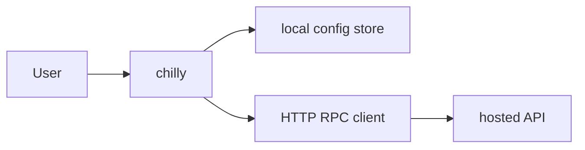
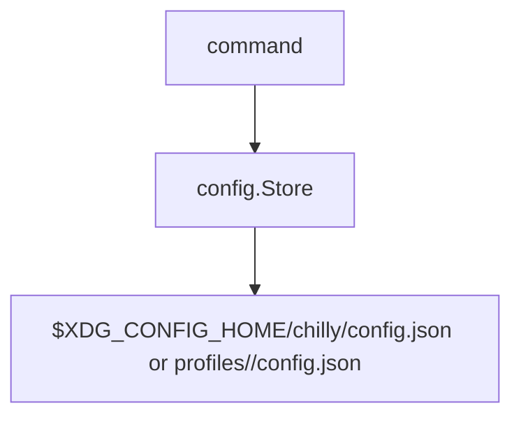
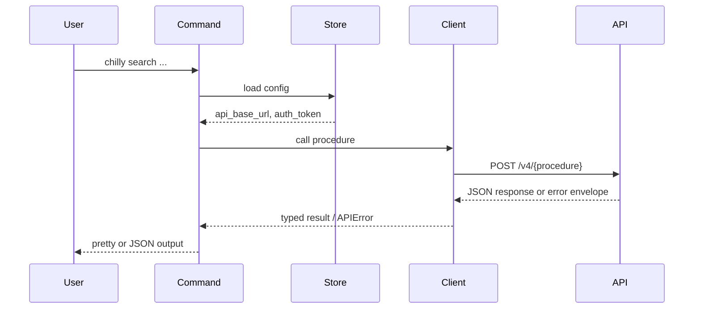
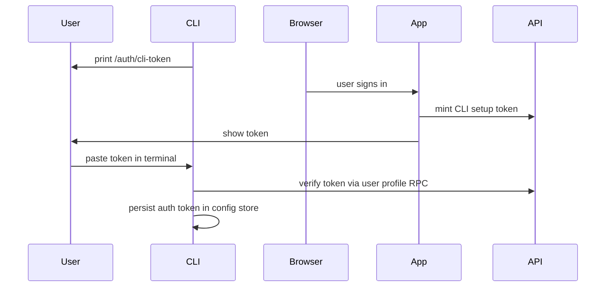

# Architecture

This document describes how `chill-cli` is built.

## System Context

## Components

| Component | Responsibility | Talks to |
|-----------|----------------|----------|
| Cobra command layer | Parse commands, flags, and output mode | app context, config store, RPC client |
| App context | Share config path, API URL, output mode, and helpers | commands, config store |
| Metadata registry | Describe public commands and linked backend procedures for agents | commands, schema surfaces |
| Config store | Persist local auth token and API base URL | filesystem |
| RPC client | Send JSON requests to v4 procedures, attach auth headers, map errors | hosted API |
| Build info | Carry version, commit, and build date into released binaries | version command, release flow |
| Release updater | Resolve GitHub releases and install matching binaries | self-update command |
| Output renderers | Render pretty or JSON command output | command handlers |

## Command Model

The Cobra command layer groups authentication, diagnostics, settings, discovery,
catalog, search, and transfer workflows. `chilly --help` is the canonical human
listing; `chilly schema` and `chilly <command> --describe` expose the same command
and procedure contracts for agents.

## Local State

The config store owns:

- API base URL
- auth token
- active profile selection via CLI flags and environment

The store normalizes defaults and writes atomically through a temp-file replace flow.
It also keeps the config directory private (`0700`) and the config file private (`0600`).
The historical production path stays at `.../chilly/config.json`. Named profiles live under `.../chilly/profiles/<profile>/config.json`.
Dev builds resolve to the `dev` profile automatically unless `--profile`, `CHILLY_PROFILE`, or `--config` overrides it.

## Request Flow

## API Client Model

The current client is intentionally lightweight:

- it sends HTTP POST requests directly to `/v4/{procedure}`
- it supports `none` and `user` auth modes
- it adds `X-Request-Id` for tracing
- it identifies requests as `cli` through `X-Chill-Client`
- it sends the binary build version through `X-Chill-Client-Version`
- it parses the shared error envelope into `APIError`

The RPC client is a manual, procedure-oriented transport rather than a generated binding.

## Introspection Model

The CLI keeps a local metadata registry for:

- public command schemas
- backend procedure schemas linked from those commands
- selected output type schemas with protobuf field names and protobuf JSON names
- raw JSON request-body entrypoints for agent-facing mutating commands
- dry-run eligibility for mutating surfaces
- field-selection eligibility for read surfaces and schema views
- supported single-field patch semantics for user settings

That registry is the source of truth for:

- `chilly schema`
- `chilly <command> --describe`
- canonical-vs-alias metadata for overlapping top-level and nested commands
- raw request-body support such as `add-transfer --json @-`, `auth login --json @-`, `settings set --json @-`, and `self-update --json`
- mutually exclusive command input modes such as `add-transfer --url` vs `add-transfer --json`, and `settings set <key> <value>` vs `settings set --json`
- current `--dry-run` support for mutating commands
- current `--fields` support for read commands and schema surfaces

Discovery is explicit and local to the CLI repo through the metadata registry.

## Agent Knowledge Packaging

The repo ships one entry skill at `skills/chilly-cli` and uses nested reference docs under `skills/chilly-cli/references/` for progressive disclosure:

- `auth.md`: login, logout, `whoami`, host checks, and profile isolation
- `read.md`: read-only hosted API workflows
- `mutate.md`: side-effecting workflows with `--dry-run` and raw payload guidance
- `contracts.md`: `schema`, `--describe`, `doctor`, and local contract discovery

This keeps the top-level skill stable while letting agents load only the workflow-specific reference they need next. The same security posture applies across the skill and its references: the agent is not a trusted operator, so narrow reads, explicit schema discovery, local validation, and request previews are preferred over optimistic execution.

## Package Layout

- `cmd/chilly`: process entrypoint
- `internal/cli`: Cobra adapter layer and command orchestration
  - command files are named after the surface they expose, such as `auth.go`, `search.go`, and `user.go`
  - shared support files are named by role, such as `output_pretty.go`, `output_fields.go`, `schema_registry.go`, and `rpc_procedures.go`
  - the package stays flat on purpose so the command surface is easy to scan without introducing shallow helper subpackages
- `internal/config`: local config persistence and normalization
- `internal/rpc`: low-level API transport
- `internal/buildinfo`: version metadata injected at build time
- `internal/update`: reusable GitHub release lookup and binary replacement logic
- `scripts/`: install helpers shipped with the repo

This keeps CLI command glue separate from reusable transport and release modules.

## Boundaries

- Local config is the CLI's persistent state.
- The hosted API owns product behavior; the CLI owns local validation, transport, and rendering.
- Auth is bearer-token based for user-scoped commands.

## Output And Error Contract

- Successful command data is written to `stdout`.
- Prompts, warnings, and error output are written to `stderr`.
- When `stdout` is not a terminal and `--output` is not set explicitly, command data defaults to compact JSON.
- In `--output json` and `--output ndjson`, failures emit a single JSON error envelope to `stderr`.
- `--output ndjson` renders root arrays as one JSON value per line. For object responses with array fields, each line is an envelope with `path`, `index`, `item`, and scalar `context`.
- Exit codes are classified into usage (`2`), auth (`3`), API (`4`), and internal (`5`) failures.

For supported mutating commands, `--dry-run` validates local input and writes a deterministic request or config-change preview to `stdout` without mutating local state, loading auth, or calling the API.

`add-transfer`, `auth login`, `settings set`, and `self-update` accept two request styles:

- convenience flags such as `--url`, `--token`, `--check`, or positional key/value arguments
- raw JSON request bodies with `--json`, including `--json @-` to read from stdin when a pipeline is easier than shell-escaping

`user settings set` supports two write paths:

- full JSON request bodies with `--json`, including `--json @-` to read from stdin
- one-field patch mode that fetches current settings, merges a validated patch, and saves the full object back through the existing RPC

Read commands that declare field-selection support apply `--fields` as a client-side mask before rendering JSON. Use `chilly schema command <name> --output json` to inspect the current capability instead of relying on a copied command list.

Schema type metadata is available through `schema type`. Field masks accept exact JSON field names and protobuf snake_case aliases, so `results.release_info.bit_depth` selects the JSON field `results.releaseInfo.bitDepth`.

`mise run contracts:check` compares selected local schema metadata against a sibling `chill-contracts` proto checkout. The regular test suite skips that drift check when the sibling checkout is not available, while the mise task requires it.

Hosted API data is untrusted content. The CLI preserves returned strings as data, and the bundled skill instructs agents not to follow instructions embedded in titles, folder names, indexer names, status messages, or other response fields.

Search hardens opaque `--indexer-id` input before it reaches the API. It rejects control characters, traversal-like segments, percent-encoded strings, and embedded path/query/fragment characters so agent hallucinations fail locally instead of leaking into remote requests. The low-level RPC client applies the same class of checks to procedure names before building `/v4/{procedure}` URLs, and `settings set api-base-url` rejects user info, query strings, fragments, and non-root paths.

In default pretty mode, the core read commands render small human-oriented summaries while `--output json` keeps the machine contract stable.

`doctor` is a read-only diagnostic surface. It reports the active profile, resolved config path, API base URL, build metadata, and auth health. In online mode it verifies the saved token with the user profile RPC; `--offline` limits the report to local state.

## Guardrails And Release Flow

- Local hooks live in `.githooks/`
- Hook files are intentionally tiny executable launchers; the real hook logic lives in `mise.toml`
- Shared quality tasks live in `mise.toml`
- `mise run smoke` covers fast local CLI sanity checks
- `mise run coverage:report` prints package coverage plus the lowest-covered functions
- `mise run test:integration` is opt-in and uses `CHILLY_TEST_API_URL` plus `CHILLY_TEST_TOKEN` for real hosted API checks
- `Verify` runs `mise run verify` on pull requests
- `Main` runs on pushes to `main`
- `Main` re-verifies the repo before release work starts
- semantic-release decides the next version and tag
- `Main` runs GoReleaser to publish GitHub release artifacts and update the Homebrew tap
- `Main` prepares npm package directories from GoReleaser binaries and publishes `@chill-institute/cli`; the installed binary remains `chilly`
- npm publishing uses trusted OIDC publishing from the `release` Environment
- release jobs run on GitHub-hosted Ubuntu runners so npm trusted publishing can issue supported provenance; dedicated verification jobs stay on Blacksmith
- operators can dispatch the tag-based `Release` workflow for GitHub release and Homebrew artifact recovery

## Browser Auth Flow

Interactive login uses a terminal-first hosted web token page. Desktop users can
opt into the localhost callback with `auth login --local-browser`.

The CLI talks directly to the API for token verification and user-scoped RPCs.
The default browser step obtains a setup token from the hosted app for the user
to paste into the terminal.
