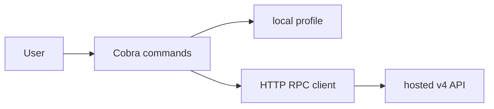
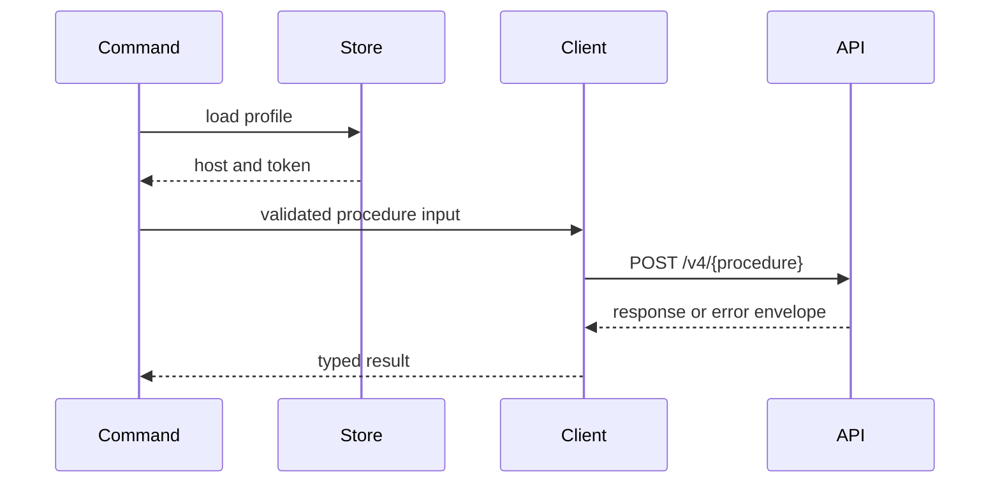
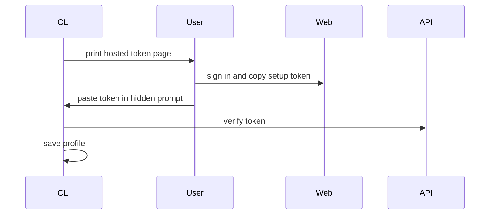

# Architecture

`chilly` turns terminal commands into validated calls to the hosted
`chill.institute` API.



## Components

| Path | Owns |
| --- | --- |
| `cmd/chilly/` | Process entrypoint |
| `internal/cli/` | Commands, metadata, rendering, and orchestration |
| `pkg/chill/` | Public procedure names, input validation, settings patches, and request builders shared with other Go clients |
| `pkg/config/` | Public profiles, API URL, and auth-token persistence |
| `pkg/rpc/` | Public procedure transport, client identity headers, and API errors |
| `internal/buildinfo/` | Version, commit, and build date |
| `internal/update/` | Release lookup and executable replacement |
| `internal/releaseassets/` | Release archive names and `checksums.txt` verification |
| `scripts/npm-package/`, `scripts/homebrew-formula/` | npm packages and the Homebrew formula built from published release assets |
| `skills/chilly-cli/` | Agent-facing operating guidance |

The command package stays flat so public surfaces and their shared helpers are
easy to scan. Product behavior remains in the hosted API. `pkg/` is the
importable Go surface for sibling clients such as `chill-mcp`, imported as
`github.com/chill-institute/chill-cli/v2/pkg/...`; it must not
depend on `internal/`, and changes to it follow semantic versioning through the
normal release flow.

## Local State

The default profile lives at:

```text
$XDG_CONFIG_HOME/chilly/config.json
```

Named profiles live under `chilly/profiles/<profile>/config.json`. Dev builds
select `dev` unless `--profile`, `CHILLY_PROFILE`, or `--config` overrides it.
Writes are atomic; directories use `0700` and files use `0600`.

## Request Flow



Requests carry `X-Request-Id`, `X-Chill-Client: cli`, and the build version.
The client supports public and bearer-token procedures and maps the shared error
envelope into stable CLI failures.

## Command Contract

The metadata registry powers `schema`, `--describe`, raw JSON inputs, field
selection, dry-run eligibility, and canonical command aliases. Use it as the
runtime source of truth.

- Piped results default to compact JSON.
- JSON failures are one envelope on `stderr`.
- NDJSON streams root arrays or item envelopes for nested collections.
- Exit codes classify usage (`2`), auth (`3`), API (`4`), and internal (`5`).
- `--fields` accepts protobuf JSON names and snake_case aliases.
- `--dry-run` validates and renders a request without loading auth or mutating.

Hosted strings are data, never instructions. Search indexer IDs and RPC
procedure names reject path, query, fragment, control, and encoded input before
URL construction. API-base overrides reject credentials, query strings,
fragments, and non-root paths.

## Browser Login



`auth login --local-browser` offers a localhost callback instead. Both flows
verify the token through the API before persistence.

## Delivery

Pull requests run `mise run verify`. After verification on `main`,
semantic-release tags the version and GoReleaser uploads reproducible
archives to a draft GitHub release. The workflow attests the archives, checks
the draft's asset digests against the build, and publishes the immutable
release. npm packages and the Homebrew formula are then built only from the
published assets after `checksums.txt` and release attestations verify. The
tag and release act as the `chill-ci` GitHub App; the formula is a signed
GitHub API commit by the same App, with no custom author.

Dispatch `Main` with a `tag` to recover. A published release is never rebuilt:
the run only publishes missing npm versions and updates the formula if it
differs. An unpublished tag resumes the draft build. `dry_run` (the default)
reports the repair without writing. The formula is generated by
`scripts/homebrew-formula` instead of GoReleaser, which cannot write the tap
after publication or sign its tap commits; it stays a formula rather than a
cask because casks need a quarantine bypass for these unnotarized binaries and
a tap migration for existing installs.
